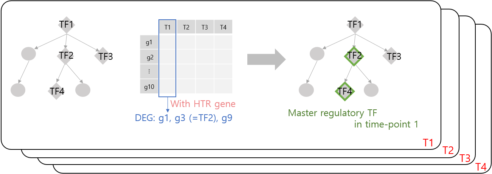
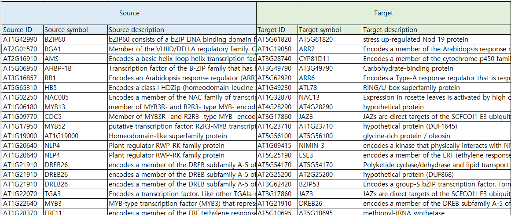

# PropaNet
PropaNet discovers the dynamics of TF networks against external stress such as heat stress or cold stress.  
Given time-series **gene expression profile data** and **template network**, PropaNet retrieves **master regulatory TFs** in each time-point.



## Installation
To download all the examples, simply clone this repository with the following command:
> `git clone https://github.com/bhi-kimlab/PropaNet.git`

## Dependency
To run them, you will need the following dependencies

#### Python2.7 : scipy.stats, networkx, multiprocessing, etc.
Python version 2.7 needs to be installed(The code may not work with Python3).  
In addition, a number of libraries are used in the analysis.  
Some of the non-default packages include scipy.stats, networkx and multiprocssing.

## Input File Format
There are three types of input files, **gene expression profile data**, **DEG binary data** and **template network**.  
Each data should take the following format:
#### Gene expression profile data
Time-series gene expression data has to be stored in a single tab-delimited matrix form.
There should be a header as the first row and it should take the following format:  

| Gene_id | Condition-time1  | Condition-time2  | Condition-time3  | Condition-time4  | ... |
| ------- | :--------------: | :--------------: | :--------------: | :--------------: | :-: |
| Gene1   | expression level | expression level | expression level | expression level | ... |
| Gene2   | expression level | expression level | expression level | expression level | ... |
| Gene3   | expression level | expression level | expression level | expression level | ... |
| ...     | ...              | ...              | ...              | ...              | ... |

###### Example)
```
gene	Heat-Shoots-0.25h	Heat-Shoots-0.5h	Heat-Shoots-1h	Heat-Shoots-3h
AT1G01010	4.91798979107909	4.81768901700114	5.67991373730826	6.02273932823551
AT1G01030	4.45806149779191	4.53272006731038	5.36916581768974	5.51771002546865
AT1G01040	3.8552645118378	3.87640592858555	4.42911094757011	4.83351626001844
AT1G01050	-2.84787294715136	-2.64691204175781	-3.05377896002984	-3.87740186446588
AT1G01060	-0.899222494190051	0.609781349298916	-0.985720858842949	1.57868637136184
AT1G01070	-0.899064779308411	0.609662493243061	0.985561143281074	1.57841350780699
AT1G01080	-0.89887322954867	-0.609596150621448	0.98554170116417	1.57833846949708
AT1G01090	0.898799238909556	0.609558025275848	0.985367888674293	-1.57830555053209
AT1G01100	-0.898776072706743	-0.609434153689444	-0.985195207884564	1.57828766511001
```

#### DEG binary indication data
DEG binary indication data is a matrix that indicates which genes in our expression data are differentially expressed genes(DEGs).  
If a value in the DEG binary indication data matrix is "1", it would mean that the corresponding gene at the same location in our expression profile data is differentially expressed.  
The following is our example DEG binary data.
```
gene	Heat-Shoots-0.25h	Heat-Shoots-0.5h	Heat-Shoots-1h	Heat-Shoots-3h
AT1G01010 1	1	-1	-1
AT1G01030	0	0	0	-1
AT1G01040	0	0	0	0
AT1G01050	0	0	0	0
AT1G01060	0	0	-1	-1
AT1G01070	0	0	0	-1
AT1G01080	0	0	0	-1
AT1G01090	0	0	0	-1
AT1G01100	0	0	0	0
...
```

#### Template network
The template network file should be comprised of 2 columns : One for source nodes and one for target nodes.  
There should be _no header_ in the first row.

| Source gene  | Target gene  |
| :----------- | :----------- |
| Source gene1 | Target gene1 |
| Source gene2 | Target gene2 |
| Source gene2 | Target gene2 |
| ...          | ...          |

###### Example)
```
AT1G01060	AT1G01470
AT1G01060	AT1G01500
AT1G01060	AT1G06460
AT1G01060	AT1G06470
AT1G01060	AT1G10200
AT1G01060	AT1G10350
AT1G01060	AT1G13590
AT1G01060	AT1G16840
AT1G01060	AT1G19630
AT1G01060	AT1G20030
...
```
---
## Results
The output is a network(in the form of an edge list) comprised of the resulting TFs/TGs that are found by PropaNet.



---
## Running PropaNet
* To run PropaNet with our example data, simply run the `run.sh` script in command line as follows.
 > `bash run.sh`

* In order to run PropaNet with another dataset,
 1. Prepare the data in the format that is described above.
 2. run the `run.sh` by feeding in the arguments as follows

 > `bash run.sh` <_Gene expression profile data_> <_DEG binary indication data_> <_Template network_> <_(optional)additional gene list_>
